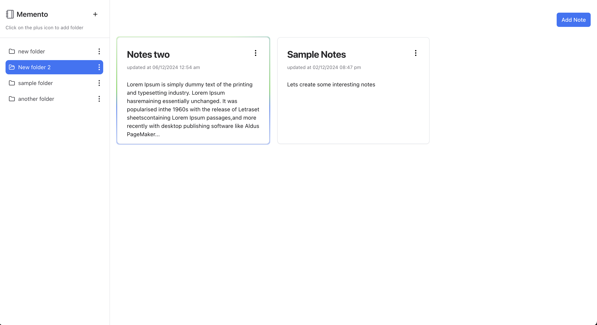
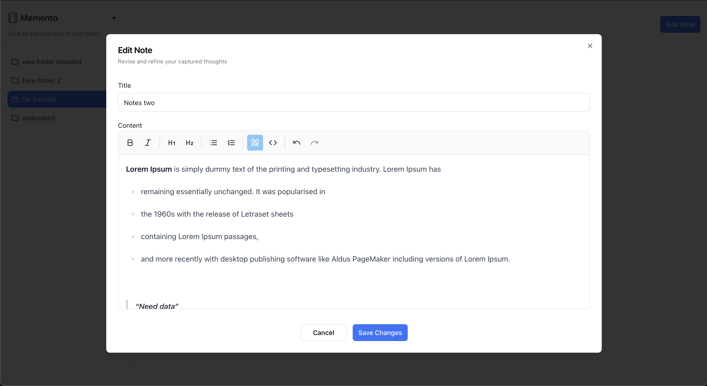

### Memento

Memento is a simple note-taking app that allows you to create, edit, and delete notes. Users can create notes in respective folders and add their own notes with a markdown editor. All data is saved in the browser's local storage.


### Getting Started
First, run the development server:
`Please make sure to have Node.js or nvm installed on your machine. Set your node version to 22.11.0`

```bash
npm run dev
# or
yarn dev
# or
pnpm dev
# or
bun dev
```

### Preview of the screens
You can interact with the app live on [Memento](https://memento-2ae.pages.dev/)





### Technologies Used

- Next.js/React
- Tailwind CSS
- TypeScript
- Framer Motion
- MobX
- Jest
- Prettier

### Folder Structure

```
src/
├── components/ # Reusable components
├── container/  # Container components
├── hooks/      # Custom hooks
├── pages/      # File based routing
├── stores/     # Logic for the app
├── utils/      # Utility functions
├── styles/     # Global styles

```

### Features

- Create, edit, and delete notes
- Create, edit, and delete folders
- Notes are saved in the browser's local storage
- Move notes between folders

### Testing

To run the tests, use the following command:

```bash
npm run test
# or
yarn test
# or
pnpm test
# or
bun test
```
